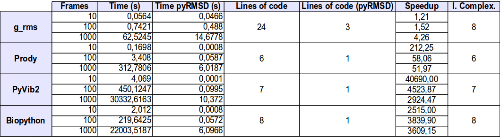

pyRMSD-Comparison
=================

This is a collection of 4 scripts that were used to compare pyRMSD against other packages:  

* g_rms: is a C-written command line program part of the Gromacs3 suite. Its main feature is the fast creation of distance matrices from trajectories.  
* Prody: is a Python package which offers very interesting features to load and analyze biomolecule trajectories, including a very complete PDB parser and a powerful selection language.  
* Biopython: is a very mature Python package which offers numerous tools for  bioinformatics computations.  
* PyVib2: is a pure Python package used to analyze vibrational motion and spectra of molecules.  

This is the results table, showing speedup and an index of integration complexity\* for a RMSD matrix calculation task.  
</img>  

g_rms gets the closer times, however is difficult to integrate, needing a wrapper to launch it and parse results. Any of the other packages has a native RMSD matrix calculation function which is one of the reasons that explain the performance difference with pyRMSD.  

\*(measured as the ratio of the number of effective lines needed to do the integration into the Python script)